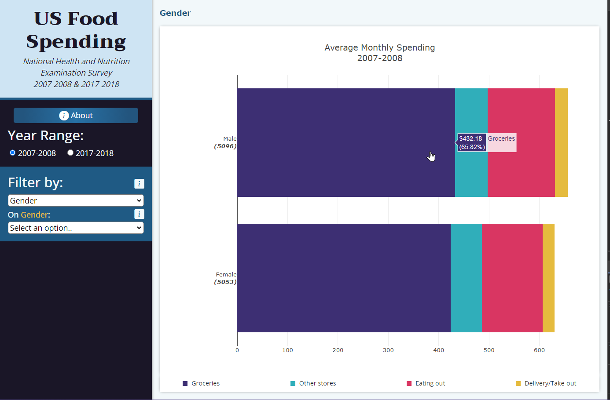
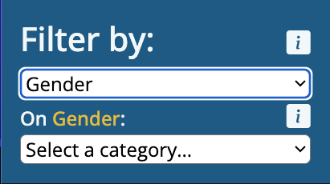

# NHANES Food Spending and Consumption Dashboard

This is an app built to explore and visualize data from the National Health and Nutrition Examination Survey (NHANES) related to food spending and consumption. The user can create bar charts by filtering the population based on demographic criteria and compare the latest data to the data collected 10 years prior.

**-- Project Status: [Completed]**

## Authors
#### Javier Robles Samar
- GitHub: [@javrobs](https://github.com/javrobs)
- E-mail address: javieroblesamar@gmail.com
- LinkedIn: [javier-robles-samar](https://www.linkedin.com/in/javier-robles-samar/)

#### Daniel R. Murillo Antuna
- GitHub: [@dan-murillo](https://github.com/dan-murillo)
- E-mail address: dmurilloantuna@gmail.com
- LinkedIn: [dan-murillo](https://www.linkedin.com/in/dan-murillo)

## Intro

The purpose of this project is to make the NHANES data more accessible by enabling users to easily plot the information they are looking for. We wanted to create a tool that would allow users to see the data through multiple filters at once to understand how variables, such as age, ethnic origin or gender, interact with each other. We also wanted to compare four different types of food spending by seeing the average monthly proportion each one has in relation to the others.

### Methods Used
    - Descriptive statistics
    - ETL
    - Data visualization

### Technologies
    - Python
    - Pandas
    - Numpy
    - SQLAlchemy
    - Flask
    - SQLite
    - Python Anywhere deployment
    - HTML/CSS
    - Javascript
    - Bootstrap
    - Plotly

## Project Description
The app was mainly designed to let the user visually explore the NHANES data. We created the visualizations to let the user see how demographic variables affect food spending behavior and let them formulate their own questions, such as:
- What type of food spending is the most popular among US consumers?
- Is there a difference in food spending among the levels of specific demographic variables, such as age or gender?

The visualizations display the mean amount of each of the four types of food spending in US dollars:
- Groceries
- Other stores
- Eating out
- Delivery/take-out

The data displayed was collected for the 2007-2008 and the 2017-2018 NHANES. A *filter* is a demographic variable in this app, and a *category* is a group or measurement of a filter.

### Challenges
#### Used the mean rather than the median in the graphs:
While applying some filters to the types of food spending, we discovered skewness. We could have used the median to correct it, but by doing so, we would have had many segments of the bar charts depicting a spending of zero dollars. We thought that it would be better to use the mean because the graphs would be clearer and contain more information to compare.

#### Removed some demographic filters:
since the aim of this app was to easily explore NHANES data, we removed the data from questions that were:
- **unrelated to food spending**: some of the variables of the NHANES had data about the interview or examination status, the language in which the interview was carried out or whether there was an interpreter during the interview.
- **from too small groups**: while some of the removed filters illustrate the situation of small groups, we chose filters that represented the majority of the sample.
- **already represented in other questions**: some of the excluded questions depicted a subsection of a more general question. Hence, we decided to focus on the data of the general question.
## Getting Started
    1. The visualization is available online at: https://javrobs.github.io/nhanes_analysis/. There is no need to do anything else, but to enter the website.

If you would like to add functions to this app:

    1. Clone this repo
    2. The raw data can be downloaded from the CDC link, which you will find in the *Sources* part of this README
    3. Our *ETL* Jupyter Notebook, which is in the *notebooks* folder, can be used to load the data to a database; you can alternatively use the database we created, which is located in the *resources* folder
    4. The visualization code can be found in the *index.html* file and the *static* folder.

## Sources
Centers for Disease Control and Prevention (CDC):
- [NHANES 2007-2008](https://wwwn.cdc.gov/Nchs/Nhanes/continuousnhanes/default.aspx?BeginYear=2007)
- [NHANES 2017-2018](https://wwwn.cdc.gov/Nchs/Nhanes/continuousnhanes/default.aspx?BeginYear=2017)

## Contributing
Contributions are always welcome! For major changes, please open an issue first to discuss what you would like to change. Please make sure to update tests as appropriate.